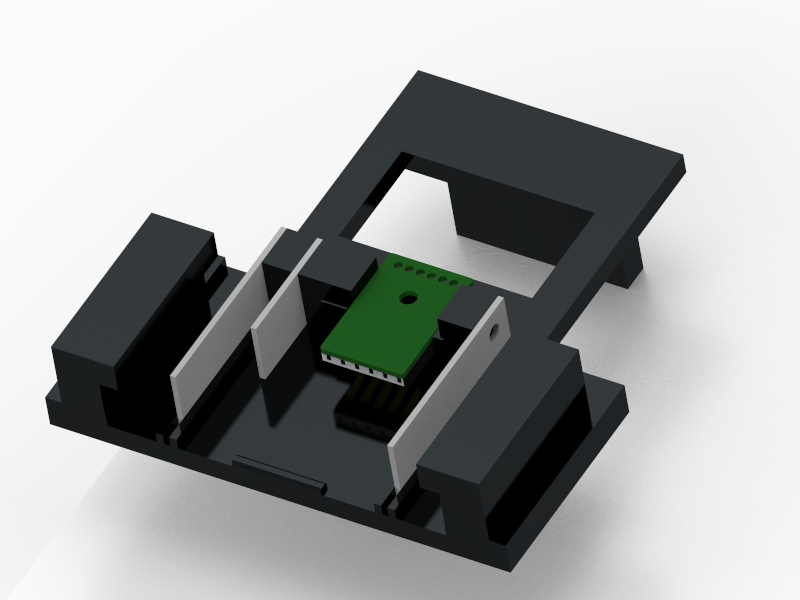
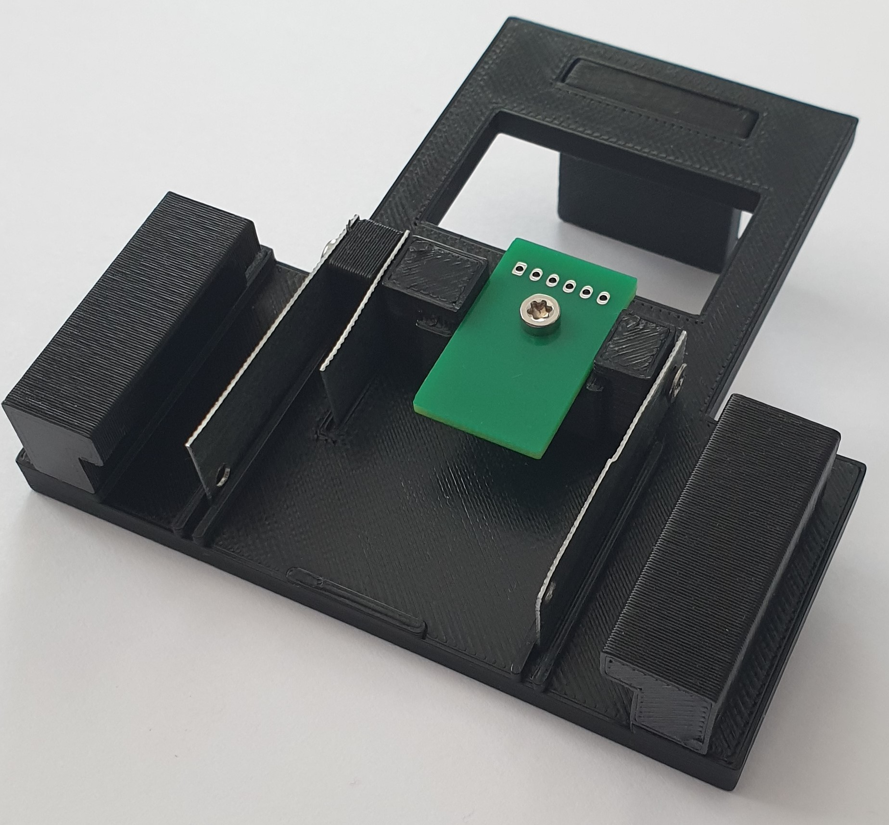
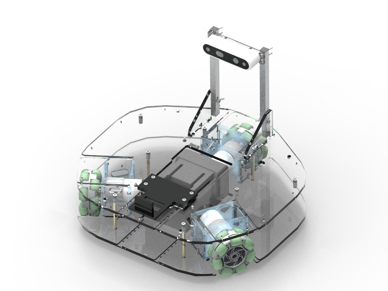
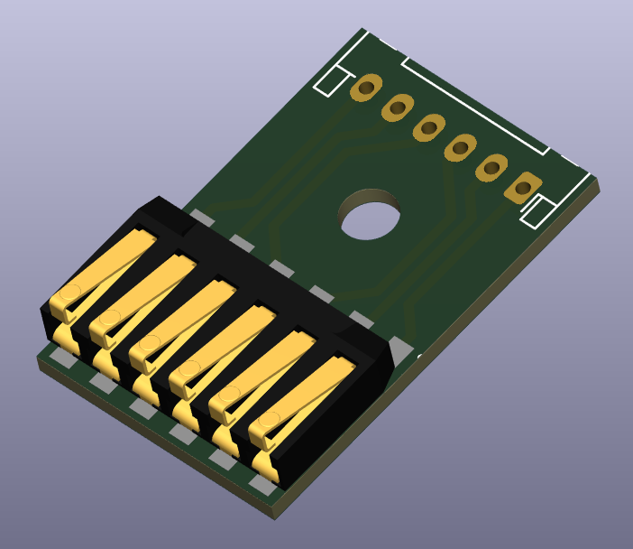
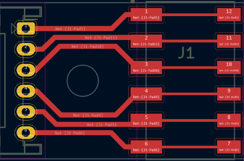
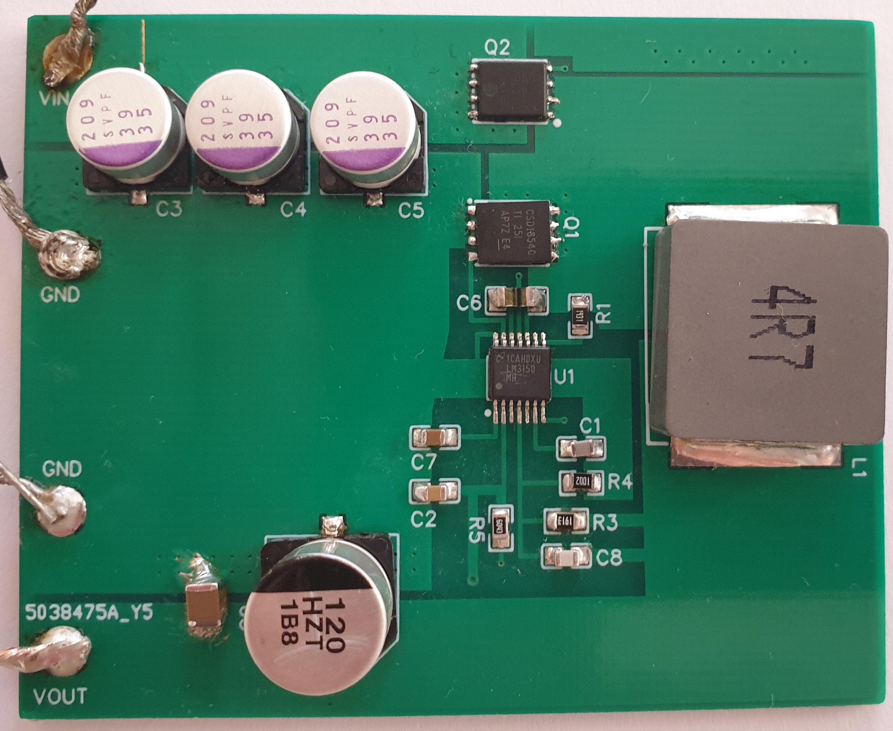
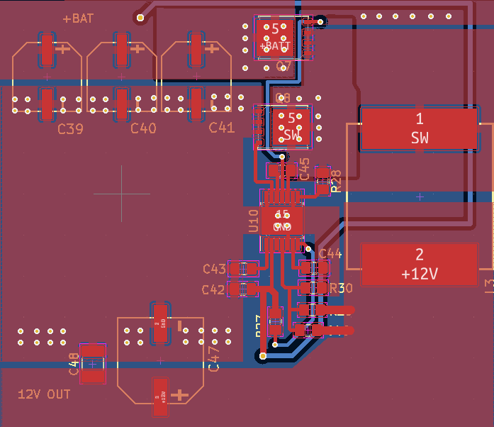

# muro-thesis-2023-robotont-battery-assembly

## ENG
Welcome to the repository for Robotont's battery assembly mechanics and 12 V voltage regulator. This repository includes KiCad project files, pictures, renders and videos that illustrate development of Robotont.

Production files for battery locking mechanism are part of gen3 Robotont development and can be found at this [repository](https://github.com/robotont/robotont-mechanics).

KiCad project files and production files for battery data adapter can be found at this [repository](https://github.com/robotont/robotont-electronics-battery-adapter).

KiCad project files and production files for voltage regulator can be found at this [folder](https://github.com/ut-ims-robotics/muro-thesis-2023-robotont-battery-assembly/tree/main/12V_DC_DC_converter). The whole design of unified PCB which integrates the voltage regulator can be found at this [repository](https://github.com/robotont/robotont-electronics-mainboard).

## EST 
Tere tulemast Robotondi akumehhanismi ja 12 V pingeregulaatori hoidlasse. Selles hoidlas on KiCadi projektifailid ning leidub samuti pilte, videosid ja 3D visualiseeringuid , mis illustreerivad Robotondi arendusprotsessi.

Aku lukustusmehanismi tootmisfailid on osa gen3 Robotondi arendusest ja asuvad siin [hoidlas](https://github.com/robotont/robotont-mechanics).

KiCadi projekti- ja tootmisfailid aku andmevahetuse adapteri jaoks asuvad siin [hoidlas](https://github.com/robotont/robotont-electronics-battery-adapter).

KiCadi projekti- ja tootmisfailid pingeregulaatori jaoks asuvad siin [kaustas](https://github.com/ut-ims-robotics/muro-thesis-2023-robotont-battery-assembly/tree/main/12V_DC_DC_converter). Kogu ühtse trükkplaadi disain (kuhu on integreeritud ka käesolev pingeregulaator) koos tootmisfailidega asub siin [hoidlas](https://github.com/robotont/robotont-electronics-mainboard).

## Battery Locking Mechanism / Aku Lukustusmehhanism
3D model and prototype of battery locking mechanism for Robotont:

 

Locking mechanism and battery in 2nd gen robot assembly:

## Battery Data Adapter / Aku Andmevahetuse Adapter
The following figures visualize the front side of the PCB along with the 3D model of the design:
 

## Voltage Regulator / Pingeregulaator

The following figures visualize the front side of the PCB along with the KiCad model of the design:
 

